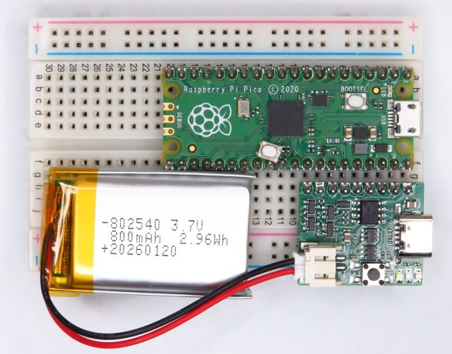
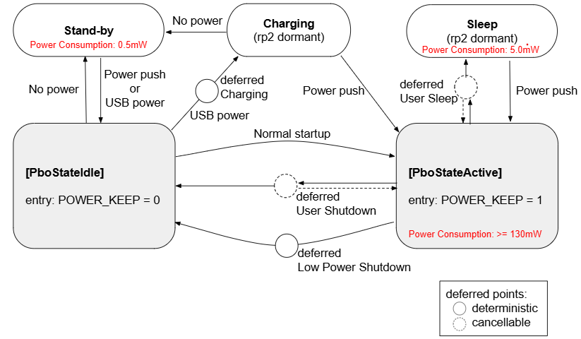

# pico_battery_op - Power Management Library for Raspberry Pi Pico / Pico 2



[](https://github.com/elehobica/pico_battery_op/actions/workflows/build-binaries.yml)

## Overview
`pico_battery_op` is a power-management library (C API, prefixed `pbo_*`) for battery-operated
Raspberry Pi Pico / Pico 2 (RP2040 / RP2350) designs. It implements a compact power state
machine on top of a **mandatory external discrete power circuit**, and provides:

* Power state machine (`Idle` / `Active`) driven by a push button switch
* RP2 (rp2040, rp2350) dormant-mode Sleep / Charging with automatic clock restore on wake
* Power-keep latch control that holds the on-board DC/DC enabled
* Battery-voltage monitor
* Low-battery detection
* USB-power-plugged (charge) detection
* Button action recognition (single / double / triple / long / long-long)
* A **deferred action** mechanism (delay, auto-run, cancelable) that the application should determine
* Callback-based integration, to implement application-specific logic on the user side

The library owns **only** power management. Presentation (OLED, LED), peripheral-power control
and product-specific UX live in the application. See the example projects under
[samples/](samples/).

## Required external circuit
The library assumes a specific discrete power-management circuit (power push switch, DC/DC enable control for power keep and charging circuit, etc.). It is **mandatory** - many code paths depend on the
wiring. A dedicated PCB providing the library's base functionality is available; see its schematic
[doc/pico_battery_op_pcb.pdf](doc/pico_battery_op_pcb.pdf). (Individual samples under
[samples/](samples/) may also document their own wiring.)

### PCB pin assignments
The PCB connects to the Pico through a single **9-pin header** on the Pico's corner block (physical
pins 32-40). It sits **directly alongside the Pico**, so both can be dropped onto a breadboard side
by side - the PCB is designed to be especially convenient for breadboard use.

| Header pin | Pico pin | Pico signal | Role on the PCB |
|---|---|---|---|
| 1 | 40 | VBUS     | USB 5 V (charger input) |
| 2 | 39 | VSYS     | system supply, switched by the PCB (battery / USB) |
| 3 | 38 | GND      | ground |
| 4 | 37 | 3V3_EN   | on-board DC/DC enable (power latch) |
| 5 | 36 | 3V3      | 3.3 V rail |
| 6 | 35 | ADC_VREF | not connected |
| 7 | 34 | GP28     | POWER_SW (power push switch input) |
| 8 | 33 | AGND     | not connected |
| 9 | 32 | GP27     | POWER_KEEP (DC/DC latch hold output) |

Other connectors on the PCB: USB-C (charging / USB-plugged detection), a battery connector, and an
external power push-switch header.

If you need GP27 or GP28 for another purpose (because they also serve as the ADC1 / ADC2 inputs) or simply
prefer a different assignment, you do not have to mount the PCB side by side: wire the PCB's
POWER_KEEP and POWER_SW to any other GPIOs instead and set `pin_power_keep` / `pin_power_sw` in
`pbo_config_t` to match.

### GPIO assignments for RP2 (from the library side)
| Signal | GPIO (default) | Direction | Note |
|--------|------|-----------|------|
| pin_power_sw         | 28         | in (pull-up) | state transitions + dormant wake (falling edge) |
| pin_power_keep       | 27         | out          | holds on-board DC/DC EN |
| pin_user_sw          | *unused*   | in (pull-up) | forwarded to the app as button events |
| PIN_USB_POWER_DETECT | 24 (fixed) | in           | charge / USB-plugged detection |
| PIN_DCDC_PSM_CTRL    | 23 (fixed) | out          | DC/DC control PFM (efficiency) / PWM (ripple) mode select |
| PIN_BATT_LVL         | 29 (fixed) | ADC3         | Battery level ADC input via 200k / 100k divider |

## Power state model

> **Terminology.** This library runs two low-power *operations*, both implemented on the RP2
> **dormant** hardware mode. Each belongs to a different state, so the POWER_KEEP latch - owned by
> the state - already tells them apart:
> - **Sleep** - a `PboStateActive` operation, entered by a POWER double push (default). The state
>   holds POWER_KEEP, so the board keeps itself powered; a power push wakes it back to
>   `PboStateActive`. (Sleep never leaves `PboStateActive`.)
> - **Charging** - a `PboStateIdle` operation, entered automatically when the board is `Idle` with
>   USB present. `Idle` releases POWER_KEEP, so power comes from USB only; if USB is removed the
>   board falls to hardware **Stand-by**. A power push wakes it into `PboStateActive`.
>
> **dormant** is the RP2 hardware low-power mode itself (the Pico SDK's term, entered via
> `sleep_goto_dormant_until_pin()`) that both operations use - unrelated to `sleep_ms()`, an
> ordinary busy-wait delay.

| Operation | State | POWER_KEEP | Powered by | Wake (power push) | If USB removed |
|---|---|---|---|---|---|
| **Sleep**    | `PboStateActive` | held     | own latch (battery / USB) | -> `PboStateActive` | stays (latch holds) |
| **Charging** | `PboStateIdle`   | released | USB only                  | -> `PboStateActive` | -> **Stand-by** (off) |

**Stand-by (hardware)** - the RP2 DC/DC is off and the firmware is not running. The board is
powered on by the external H/W circuit (power-switch push, or USB plug). In firmware this
condition is represented only at its boundary, as `PboStateIdle`.

### State transition model


### States (`pbo_state_t`)
| State | POWER_KEEP | Meaning | Transition |
|-------|-----------|---------|------------|
| `PboStateIdle`   | released (0) | Boot boundary and shutdown target. Not a running state. | With USB present -> **Charging** (dormant); without USB -> hardware **Stand-by** (power off). |
| `PboStateActive` | held (1)     | Running. | A **Sleep** puts the CPU into dormant mode while staying in `PboStateActive` - it is not a separate state. |

### Boot / power-on behavior
By default, when USB is not connected, the board is in **Power OFF (Stand-by)** right after a reset
is released; turn it on with the **Power ON switch** (which sets the DC/DC latch in hardware). When
**USB is connected**, the board powers up and enters **Charging** (dormant); power is still
supplied over USB in this state, so a firmware update (flashing over USB) is possible. The firmware
decides the boot state as follows:

| Condition | Result |
|---|---|
| USB present | powered up, then **Charging** (dormant); USB keeps it powered. |
| No USB, Power ON switch held (a real power-on) | come up running. |
| No USB, switch not held (e.g. a warm RUN reset) | Power OFF (hardware Stand-by). |

So with no USB, a reset always restarts from **Power OFF** regardless of the state before the reset;
press the Power ON switch to run again.

### Deferred actions (`pbo_deferred_reason_t`)
The purpose of deferring is to give the application a time window before a Shutdown / Sleep / Charging
transition actually happens - long enough to show the user that the transition is coming (an
"announce" screen, LED pattern, etc.). Combined with cancellation it goes one step further: the
application can announce the pending transition while letting the user decide whether to cancel it
(otherwise the transition proceeds on its own).

Every "wait, then perform a terminal power action" is modeled as a **deferred action**: scheduled
now and **run automatically** after a delay, unless canceled. Delays come from `pbo_config_t`
(default 0 ms, so the action runs on the next `pbo_process()`; set non-zero for an announce window,
as the ssd1306 sample does) and are measured with absolute time (no fixed loop-cadence assumption).

| Reason (enum) | Diagram label | Trigger | Result | Cancelable |
|---|---|---|---|---|
| `PboDeferredSleep`      | deferred User Sleep         | POWER double push (default, in `Active`)    | enter **Sleep** (dormant; stays `Active`) | yes |
| `PboDeferredShutdown`   | deferred User Shutdown      | POWER long-long push (default, in `Active`) | release latch -> `Idle` | yes |
| `PboDeferredLowBattery` | deferred Low Power Shutdown | low battery (in `Active`)                   | release latch -> `Idle` | no |
| `PboDeferredCharge`     | deferred Charging           | entering `Idle` with USB present            | enter **Charging** (dormant) | no |

`Cancelable = yes` corresponds to the diagram's **cancellable** (dashed) deferred points, `no` to the **deterministic** (solid) ones.

While a deferred action is pending, the library forwards button events to `on_button_event`, so the
application can call `pbo_cancel_deferred()` (e.g. a second power push aborts a `Sleep` / `Shutdown`).

## API

### Lifecycle
| Function | Description |
|---|---|
| `pbo_config_t pbo_get_default_config()` | Return a config with default pins, delays and (NULL) callbacks. Override only what you need, then pass to `pbo_init()`. |
| `void pbo_init(const pbo_config_t* cfg)` | Hardware init from `cfg` (pins / delays / callbacks; `cfg = NULL` -> defaults). Applies pin assignments, so call it first. |
| `void pbo_start()` | Start the state machine (config and callbacks were already taken by `pbo_init()`); selects the initial state from USB detection. |
| `void pbo_process()` | Advance the state machine. Call periodically from the main loop (may block while dormant). |

### Configuration (`pbo_config_t`)
Obtain a fully-populated struct from `pbo_get_default_config()`, override only the members you need,
then pass it to `pbo_init()` (passing `NULL` uses all defaults).

| Member | Type | Default | Description |
|---|---|---|---|
| `pin_power_keep`    | `uint32_t`       | `27`            | Power-keep latch GPIO - see [GPIO assignments](#gpio-assignments-for-rp2). |
| `pin_power_sw`      | `uint32_t`       | `28`            | Power switch / dormant-wake GPIO - see [GPIO assignments](#gpio-assignments-for-rp2). |
| `pin_user_sw`       | `uint32_t`       | `PBO_PIN_UNUSED` | User switch GPIO; `PBO_PIN_UNUSED` (0) means not wired (so GPIO0 cannot be the user switch). |
| `sleep_defer_ms`    | `uint32_t`       | `0`             | Delay in milliseconds for `PboDeferredSleep` (0 = run immediately) - see [Deferred actions](#deferred-actions-pbo_deferred_reason_t). |
| `shutdown_defer_ms` | `uint32_t`       | `0`             | Delay in milliseconds for `PboDeferredShutdown` / `PboDeferredLowBattery` (0 = run immediately). |
| `charge_defer_ms`   | `uint32_t`       | `0`             | Delay in milliseconds for `PboDeferredCharge` (0 = run immediately). |
| `power_action_single`   | `pbo_power_action_t` | `PboActionShutdown` | Action for a POWER single push - see [Power button mapping](#power-button-mapping). |
| `power_action_double`   | `pbo_power_action_t` | `PboActionSleep`    | Action for a POWER double push. |
| `power_action_triple`   | `pbo_power_action_t` | `PboActionNone`     | Action for a POWER triple push. |
| `power_action_long`     | `pbo_power_action_t` | `PboActionNone`     | Action for a POWER long push. |
| `power_action_longlong` | `pbo_power_action_t` | `PboActionShutdown` | Action for a POWER long-long push. |
| `batt_calib_coef_a` | `float`          | `2.9917`        | Battery ADC calibration scale in the linear fit `battery_voltage[V] = adc_pin_voltage * batt_calib_coef_a + batt_calib_coef_b`. Ideally the divider ratio (200k/100k -> 3.0), trimmed by measurement. |
| `batt_calib_coef_b` | `float`          | `-0.020`        | Battery ADC calibration offset [V] added after scaling, compensating divider/ADC bias (see `batt_calib_coef_a`). |
| `low_battery_threshold` | `float`      | `2.9`           | Battery voltage [V] below which the low-battery flag latches (triggers `PboDeferredLowBattery`). |
| `callbacks`         | `pbo_callbacks_t` | all `NULL`      | Application callbacks - see [Callbacks](#callbacks-pbo_callbacks_t-all-optional). |

### Button gestures
Both the POWER and USER switches report the same set of gestures (`ButtonPower*` / `ButtonUser*` in
`button_action_t`). Recognition is edge-based on a 20 Hz sampler:

| Gesture | Fires when |
|---|---|
| `Single`   | pressed briefly and released (a single click) |
| `Double`   | pressed twice in quick succession, on the final release |
| `Triple`   | pressed three times in quick succession, on the final release |
| `Long`     | held for **~1 s** (does not also emit `Single` / `Double` / `Triple` in the same press) |
| `LongLong` | held for **~2 s** (likewise no `Single` / `Double` / `Triple`; emitted after `Long` has already fired during the same continuous hold) |

`Single` / `Double` / `Triple` fire on release (click counting), while `Long` / `LongLong` fire
while the button is still held, at the moment their thresholds are reached.

### Power button mapping
Each POWER-switch gesture is mapped to a power action via `power_action_*` (`pbo_power_action_t`):

| Action | Effect |
|---|---|
| `PboActionNone` | not a power trigger; the gesture is forwarded to `on_button_event` for the app to handle |
| `PboActionSleep` | enter dormant mode (schedules `PboDeferredSleep`, honoring `sleep_defer_ms`) |
| `PboActionShutdown` | shut down (schedules `PboDeferredShutdown`, honoring `shutdown_defer_ms`) |

Defaults:

| POWER gesture | Power action | Effect while `Active` |
|---|---|---|
| single         | `PboActionNone`     | forwarded to `on_button_event` (no power effect) |
| double         | `PboActionSleep`    | enter dormant mode |
| triple         | `PboActionNone`     | forwarded to `on_button_event` |
| long (1 s)     | `PboActionNone`     | forwarded to `on_button_event` |
| long-long (2 s)| `PboActionShutdown` | shut down |

**Asymmetric ON / OFF.** Turning the board **ON** is a fixed behavior outside this mapping: a single
POWER push while OFF (`Idle` / dormant) always powers up / wakes. The mapping therefore only
governs what happens while the board is already **ON**, which lets you assign ON and OFF (and Sleep)
asymmetrically. With the defaults:

- OFF + single push -> **ON** (fixed; power-up / wake)
- ON + long-long push (2 s) -> **OFF** (Shutdown)
- ON + double push -> **Sleep**
- ON + single push -> **nothing** - free for the application to use for a non-power feature via `on_button_event`

The deliberately heavier gesture for OFF (a 2 s hold) guards against an accidental single press
powering the board down, while that same single press stays available to your app.

Override only what you want to change, for example to make a single push enter dormant mode:

```c
config.power_action_single = PboActionSleep;
```

### Callbacks (`pbo_callbacks_t`, all optional)
| Callback | When | Typical use |
|---|---|---|
| `on_state_changed(new, prev)` | after an `Idle` ↔ `Active` transition (a Sleep stays `Active`, so it does not fire) | react to entering `Idle` (e.g. persist state before power-off) |
| `on_deferred(reason)` | a deferred action was scheduled (delay began) | start rendering the announcement |
| `on_button_event(btn)` | gestures not mapped to a power action (user gestures, and POWER gestures set to `PboActionNone`), and all events while a deferred action is pending | product features / call `pbo_cancel_deferred()` |
| `on_enter_dormant()` | just before entering dormant mode (a Sleep or Charging) | quiesce peripherals (display off, peripheral power off); optionally call `pbo_dormant_set_low_leakage()` - see [Low-power tuning](#low-power-dormant-tuning) |
| `on_exit_dormant()` | just after waking (state already `Active`) | restore peripherals (peripheral power on); re-init any pins released by a low-leakage sweep |

All callbacks run in `pbo_process()` (main-loop) context - never in an ISR.

### Query / control
| Function | Description |
|---|---|
| `pbo_state_t pbo_get_state()` | Get current state. |
| `bool pbo_get_deferred(pbo_deferred_info_t* out)` | Get pending deferred action (reason / remaining_ms / cancelable); `false` if none. |
| `bool pbo_cancel_deferred()` | Cancel the pending deferred action if cancelable; returns whether one was canceled. |
| `uint32_t pbo_get_state_elapsed_ms()` | Get milliseconds since the current state was entered (blink timing). |
| `float pbo_get_battery_voltage()` | Get battery voltage in volts. |
| `bool pbo_get_usb_power_detected()` | Get USB power detected. |
| `void pbo_reboot()` / `bool pbo_is_caused_reboot()` | Watchdog reboot helpers. |

### Low-power (dormant) tuning
While dormant, every GPIO keeps its pad configuration and any pull fighting an external level or
floating enabled input keeps leaking current. To minimize that leakage, call
`pbo_dormant_set_low_leakage()` from `on_enter_dormant()`:

| Function | Description |
|---|---|
| `uint32_t pbo_get_dormant_reserved_pin_mask()` | Bitmask (bit i = GPIO i) of the GPIOs the library must keep alive across dormant (wake pin, power-keep latch, and the other library-owned pins). Building block for a safe exclude mask. |
| `void pbo_dormant_set_low_leakage(uint32_t app_hold_mask)` | Put every GPIO that is neither reserved by the library nor listed in `app_hold_mask` into the lowest-leakage state (pulls off, input buffer off, output driver off). Pass in `app_hold_mask` any application pin that must keep driving its level through dormant. |

The library never touches its own pins, so an application only needs to manage its own. The sweep is
**destructive and does not save pad state**: re-initialize any pin you let go (not in `app_hold_mask`)
after wake, in `on_exit_dormant()`. Requires the `pico_low_power` library (Pico SDK 2.3.0+), which the
`INTERFACE` target links transitively - no extra linkage in your app.

```c
// Pins your application drives (examples).
#define MY_LED_PIN    16u   // an output you can let go while dormant
#define MY_HOLD_PIN   18u   // an output that must keep its level while dormant

static void on_enter_dormant() {
    // ... quiesce your peripherals here (displays, sensors, peripheral power, ...) ...

    // Keep MY_HOLD_PIN driving through dormant; sweep every other non-reserved pin to the
    // lowest-leakage state. Pass 0 if nothing needs to keep its level.
    pbo_dormant_set_low_leakage(1u << MY_HOLD_PIN);
}

static void on_exit_dormant() {
    // Re-initialize the pins the sweep released (everything you use again that was not in
    // app_hold_mask). gpio_init() clears the low-leakage overrides; then re-apply each pin's
    // direction / function / pulls. The library's own pins are untouched, so skip them.
    gpio_init(MY_LED_PIN);
    gpio_set_dir(MY_LED_PIN, GPIO_OUT);
    // ... re-init other released pins, then restore your peripherals ...
}
```

For a concrete, board-specific version of this, see
[`samples/battery_op_with_ssd1306/main.cpp`](samples/battery_op_with_ssd1306/main.cpp).

## Using the library in your own project
The library is an `INTERFACE` CMake target. From a sample/app `CMakeLists.txt`:
```cmake
add_subdirectory(../.. pico_battery_op)          # this library
target_link_libraries(${PROJECT_NAME} pico_battery_op)
```
Minimal main loop:
```c
pbo_config_t config = pbo_get_default_config();
config.pin_user_sw = 17;             // override only what your board needs
config.callbacks.on_button_event = on_button_event;
pbo_init(&config);                    // NULL -> all defaults
pbo_start();
while (true) {
    pbo_process();                    // library runs the power state machine
    // render UI from pbo_get_state() / pbo_get_deferred()
    sleep_ms(100);
}
```
See the example projects under [samples/](samples/) for complete examples.

## How to build with docker image
* Builds the firmware inside [pico-sdk-dev-docker:sdk-2.3.0](https://hub.docker.com/r/elehobica/pico-sdk-dev-docker) (same image used by CI). Requires Docker; no local Pico SDK setup is needed.
* `samples/build_docker.sh` drives the container build. The sample to build is taken from the current directory, so run it from inside the sample folder you want to build (`samples/xxxx`).
```
$ git clone -b main https://github.com/elehobica/pico_battery_op.git
$ cd pico_battery_op/samples/xxxx
$ ../build_docker.sh           # build both targets (default)
$ ../build_docker.sh pico      # build only Pico / Pico W      -> build/xxxx.uf2
$ ../build_docker.sh pico2     # build only Pico 2 / Pico 2 W  -> build2/xxxx.uf2
```
* Outputs: `build/xxxx.uf2` (Pico / Pico W), `build2/xxxx.uf2` (Pico 2 / Pico 2 W)
* Download "*.uf2" on RPI-RP2 or RP2350 drive

## How to build in local
* See ["Getting started with Raspberry Pi Pico"](https://datasheets.raspberrypi.org/pico/getting-started-with-pico.pdf)
* Put "pico-sdk", "pico-examples" and "pico-extras" on the same level with this project folder.
* Set environmental variables for PICO_SDK_PATH, PICO_EXTRAS_PATH and PICO_EXAMPLES_PATH
* Confirmed with Pico SDK 2.3.0
```
> git clone -b 2.3.0 https://github.com/raspberrypi/pico-sdk.git
> cd pico-sdk
> git submodule update -i
> cd ..
> git clone -b sdk-2.3.0 https://github.com/raspberrypi/pico-examples.git
>
> git clone -b sdk-2.3.0 https://github.com/raspberrypi/pico-extras.git
> 
> git clone -b main https://github.com/elehobica/pico_battery_op.git
```
### Windows
* Build is confirmed in Developer Command Prompt for VS 2022 and Visual Studio Code on Windows environment
* Confirmed with cmake-3.27.2-windows-x86_64 and gcc-arm-none-eabi-10.3-2021.10-win32
* Lanuch "Developer Command Prompt for VS 2022"
```
> cd pico_battery_op\samples\xxxx
> mkdir build && cd build
> cmake -G "NMake Makefiles" ..  ; (for Raspberry Pi Pico 1 series)
> cmake -G "NMake Makefiles" -DPICO_PLATFORM=rp2350 -DPICO_BOARD=pico2 ..  ; (for Raspberry Pi Pico 2)
> nmake
```
* Put "*.uf2" on RPI-RP2 or RP2350 drive
### Linux
* Build is confirmed with [pico-sdk-dev-docker:sdk-2.3.0]( https://hub.docker.com/r/elehobica/pico-sdk-dev-docker)
* Confirmed with cmake-3.22.1 and arm-none-eabi-gcc (15:10.3-2021.07-4) 10.3.1
```
$ cd pico_battery_op/samples/xxxx
$ mkdir build && cd build
$ cmake ..  # (for Raspberry Pi Pico 1 series)
$ cmake -DPICO_PLATFORM=rp2350 -DPICO_BOARD=pico2 ..  # (for Raspberry Pi Pico 2)
$ make -j4
```
* Download "*.uf2" on RPI-RP2 or RP2350 drive
