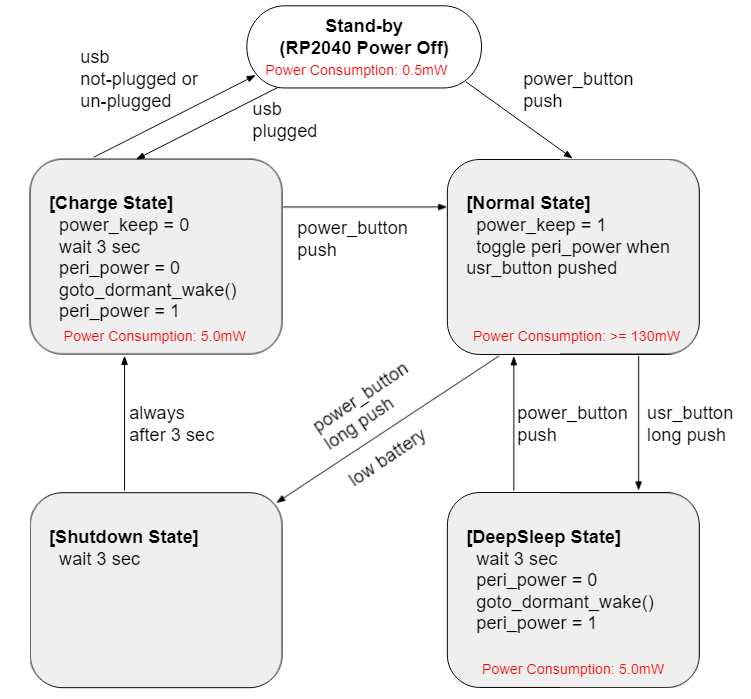

# Raspberry Pi Pico Battery Operation


## Overview
This is a sample project for battery operation of Raspberry Pi Pico.<br>
External circuit described in Schematic is mandatory to operate this project.

This project supports:
* power state transition for stand-by (RP2040 off), normal operation, deep sleep and shutdown.
* control of peripheral 3.3V power
* battery voltage monitor and low battery shutdown function
* USB plugged detection

## Supported Board and Peripheral Devices
* Raspberry Pi Pico
* SSD1306 OLED display 128x64 pixels
* TP4056 Project (Li-po battery chargeer)

## Power state description
### Power state transition diagram


### Stand-by
* achieve very low power consumption by shutdown of DC/DC converter on Raspberry Pi Pico
* RP2040 and peripheral power are completely set to power-off
* power consumption is under 0.5 mW
* transition to Normal state by power switch long push (power-on by H/W circuit)
* transition to Charge state by detection of USB plugged (power-on by H/W circuit)

### Normal state
* in this project sample, LED is blinking in this state
* toggle peripheral power by user switch single push (in this project OLED display runs under peripheral power)
* detectable for power provided from battery or USB power
* transition to DeepSleep state by user switch long push
* transition to Shutdown state by power switch long push or low battery detected

### DeepSleep state
* achieved by dormant state served in pico-sdk
* power consumption is around 5 mW
* transition to Normal state by power switch single push

### Shutdown state
* goto Charge state in 3 seconds

### Charge state
* When USB plugged, indicate "Charging" display then enter and keep dormant to minimize charge current
* When USB unplugged, return to Stand-by
* transition to Normal state by power switch single push
* Firmware update is also available in this state

## Schematic
optimized version with SMD devices

[RPi_Pico_battery_operation.pdf](doc/RPi_Pico_battery_operation.pdf)

Alternative schematic for the case non-SMD devices are desirable for bread board test

[RPi_Pico_battery_operation_breadboard.pdf](doc/RPi_Pico_battery_operation_breadboard.pdf)

## How to build
* See ["Getting started with Raspberry Pi Pico"](https://datasheets.raspberrypi.org/pico/getting-started-with-pico.pdf)
* Build is confirmed only in Developer Command Prompt for VS 2019 and Visual Studio Code on Windows enviroment
* Put "pico-sdk", "pico-examples", "pico-extras" and "pico-playground" on the same level with this project folder.
```
> git clone -b master https://github.com/raspberrypi/pico-sdk.git
> cd pico-sdk
> git submodule update -i
> cd ..
> git clone -b master https://github.com/raspberrypi/pico-examples.git
> 
> git clone https://github.com/raspberrypi/pico-extras.git
> cd pico-extras
> git submodule update -i
> cd ..
> git clone https://github.com/raspberrypi/pico-playground.git
> 
> git clone -b main https://github.com/elehobica/pico_battery_op.git
```
* Lanuch "Developer Command Prompt for VS 2019"
```
> cd pico_battery_op
> mkdir build
> cd build
> cmake -G "NMake Makefiles" ..
> nmake
```
* Put "pico_battery_op.uf2" on RPI-RP2 drive
