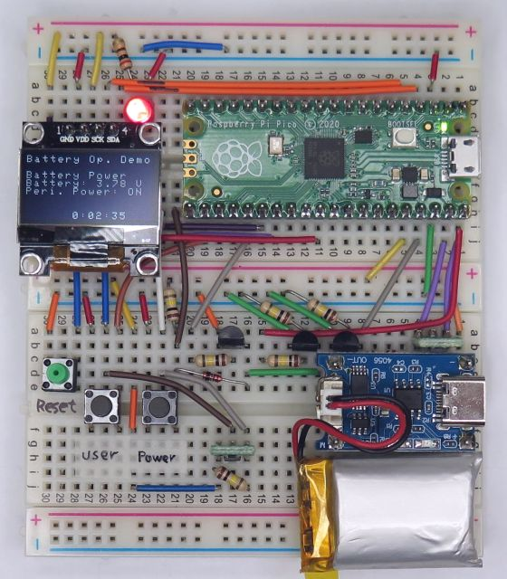
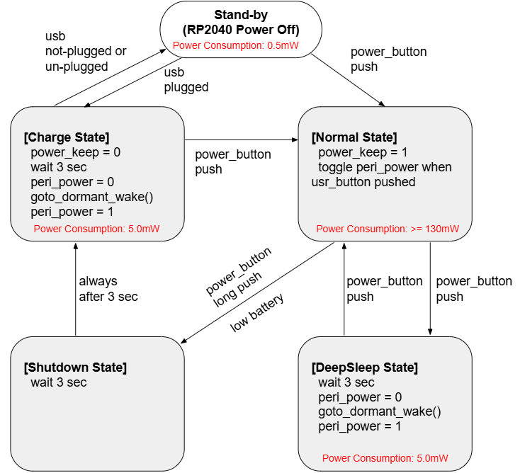

# battery_op_with_ssd1306



Reference application for the [pico_battery_op](../../README.md) power-management library.
On top of the library's power state machine it adds an SSD1306 OLED status display,
peripheral 3.3 V power control, an LED activity indicator, and the product-specific
button UX. All of this is **application** code - the library itself knows nothing about
the display, the LED, or peripheral power.

## Supported board and peripheral devices
* Raspberry Pi Pico
* Raspberry Pi Pico 2
* SSD1306 OLED display 128x64 pixels (I2C1 on GPIO2 / GPIO3)
* TP4056 module (Li-po battery charger)

## Hardware / schematic
This sample requires the mandatory external discrete power circuit assumed by the library
(external DC/DC EN control, battery voltage divider, USB detect, peripheral power switch).

* Optimized version with SMD devices - [doc/battery_op_with_ssd1306_schematic.pdf](doc/battery_op_with_ssd1306_schematic.pdf)
* Alternative for breadboard test (non-SMD) - [doc/battery_op_with_ssd1306_breadboard_schematic.pdf](doc/battery_op_with_ssd1306_breadboard_schematic.pdf)

### Comments for schematic
* T1 switches battery power to be used only when USB is unplugged. Please refer to the "Using a Battery Charger" section of [pico-datasheet.pdf](https://datasheets.raspberrypi.org/pico/pico-datasheet.pdf)
* T2 controls the EN signal of the DC/DC converter on the Raspberry Pi Pico board. To enable the DC/DC converter, EN needs to be High by switching T2 off. T2 is on in Stand-by and turns off when the power switch is pushed, or USB is plugged, or the POWER_KEEP signal goes High.
* While USB is unplugged, VBUS can be around 0.8 V by battery power through reverse current from the Schottky diode on the Raspberry Pi Pico board. That is why the voltage divider (R4, R5) is needed at the gate of T4 to keep T4 off while USB is unplugged.
* T1 and T5 (P-ch MOSFET) are used as high-side switches. To drive the Raspberry Pi Pico and peripheral devices stably, choose P-ch MOSFETs with low On-Resistance (~0.1 ohm) and low threshold voltage (~2.5 V).

### Peripheral power (application-owned)
Peripheral 3.3 V power is controlled by the application on **GPIO20** (open-drain, active-low).
The OLED runs under peripheral power. The application:
* turns peripheral power **on** when entering `PmStateActive` (`on_state_changed`),
* turns it **off** together with the display before the library goes dormant (`on_before_dormant`),
* toggles it on a user-switch single push.

## User interface / behavior

### Power state diagram


### Display screens
| State | Display |
|-------|---------|
| `PmStateActive` | power source (`USB Power` / `Battery Power`) and voltage, `Peri. Power: ON/OFF`, an uptime clock. During an announce phase the bottom line blinks `GO DORMANT` / `SHUTDOWN` / `LOW BATTERY`. |
| `PmStateIdle` (USB present) | blinking `Charging`. |

### Buttons
| Action | Effect |
|--------|--------|
| Power switch - single push | start the `Sleep` announce (`GO DORMANT`), then dormant |
| Power switch - long push | start the `Shutdown` announce, then `Idle` (charge if USB, otherwise power off) |
| Power switch - single push during a cancelable announce | cancel it (`pm_cancel()`) |
| User switch - single push | toggle peripheral power (OLED) |
| Low battery detected | start the `LOW BATTERY` announce (not cancelable), then `Idle` |

### LED
The on-board LED blinks while running (`PmStateActive` with no pending announce); it is off otherwise.

## How the application integrates with the library
The sample registers three callbacks and drives `pm_process()` each loop
(see [main.cpp](main.cpp)):

| Callback | Application action |
|---|---|
| `on_state_changed` | turn peripheral power **on** when entering `PmStateActive` |
| `on_button_event` | user single push → toggle peripheral power; power single push (during a pending) → `pm_cancel()` |
| `on_before_dormant` | `display_deinit()` + peripheral power **off** before dormant |

```c
peripheral_power_init();
pm_config_t config = pm_get_default_config();
config.pin_user_sw = 17;                       // this board wires the user switch to GPIO17
config.sleep_defer_ms = 3000;                  // 3 s announce windows (library default is 0)
config.shutdown_defer_ms = 3000;
config.charge_defer_ms = 3000;
config.callbacks.on_button_event = on_button_event;
config.callbacks.on_enter_dormant = on_enter_dormant;
config.callbacks.on_exit_dormant = on_exit_dormant;
pm_init(&config);
pm_start();
while (true) {
    pm_process();
    // render SSD1306 from pm_get_state() / pm_get_deferred()
    sleep_ms(100);
}
```

## How to build
The output binary is `battery_op_with_ssd1306.uf2`. Using the Docker build (no local SDK needed):
```
$ cd samples/battery_op_with_ssd1306
$ ../build_docker.sh          # both targets -> build/ , build2/
$ ../build_docker.sh pico     # rp2040 only  -> build/battery_op_with_ssd1306.uf2
$ ../build_docker.sh pico2    # rp2350 only  -> build2/battery_op_with_ssd1306.uf2
```
For local SDK builds and full details, see the repository README:
[How to build](../../README.md#how-to-build-with-docker-image).
